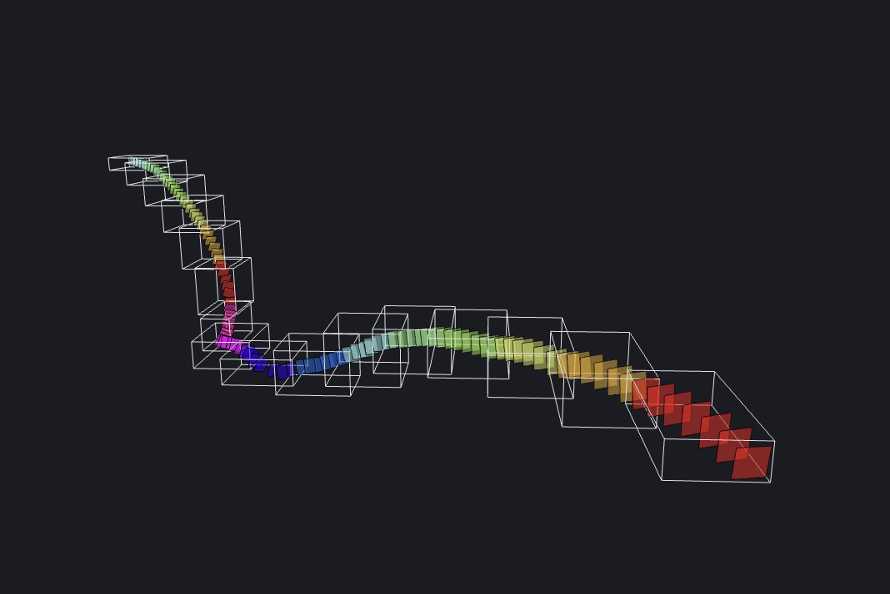
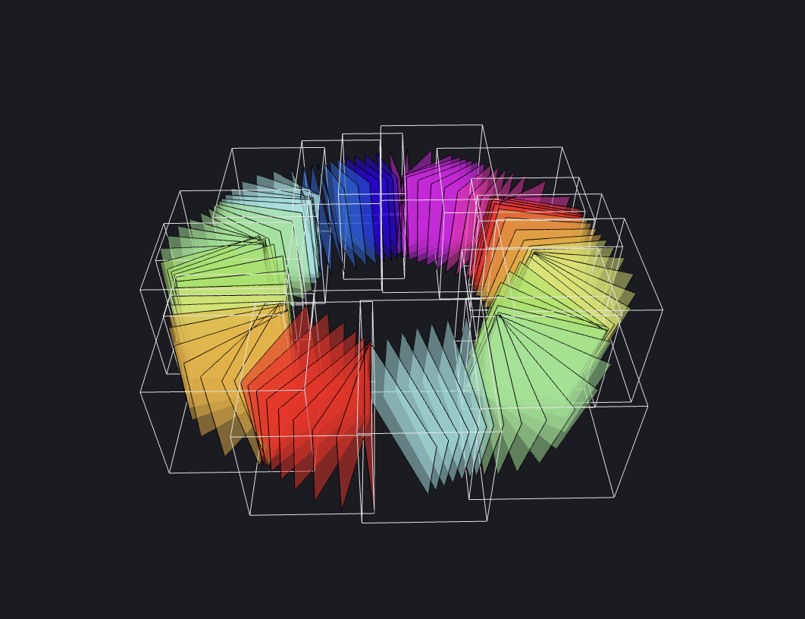

# Ouroboros

Extract ROIs from cloud-hosted medical scans.

Ouroboros is a desktop app (built with Electron) and a Python package (with a CLI). 

The desktop app comes with a pre-compiled Python server (from the Python package). It runs the server in the background to handle all processing and calculations.

If you are interested in using the Python package for its CLI or for a custom usecase, check out the [python](https://github.com/We-Gold/ouroboros/tree/main/python) folder in the main repository.

Ouroboros also supports a plugin system. A plugin usage guide is forthcoming.

## Usage Guide

_It is recommended that you read these pages in order._

- [Download and Install Ouroboros](./guide/downloading.md)
- [Slicing](./guide/slicing.md)
- [Backprojection](./guide/backproject.md)

## Ouroboros Explanation

A user of Ouroboros may have a multi-terabyte volumetric scan, hosted with the Neuroglancer family of tools (i.e. [cloud-volume](https://github.com/seung-lab/cloud-volume)). 

Perhaps there is a long, relatively sparse structure (ROI), like a nerve or a blood vessel that crosses the entire scan. Even with a well-equipped computer, it would be difficult to segment the entire stucture in one pass due to RAM limitations.

Ouroboros provides a solution. A user first traces the structure in Neuroglancer with sequential annotation points, and then saves the JSON configuration to a file.

Ouroboros opens this configuration file and cuts rectangular slices along the annotation path, producing a straightened volume with the ROI at the center of each slice (usually much smaller than the original scan).

_Every tenth slice in a circular annotation path, rendered in Ouroboros's Slicing Page._

From there, the user segments the much smaller straightened volume with their choice of segmentation system. Then, Ouroboros [backprojects](./guide/backproject.md) the segmented slices into the original volume space (unstraightens it), producing a full segmentation.